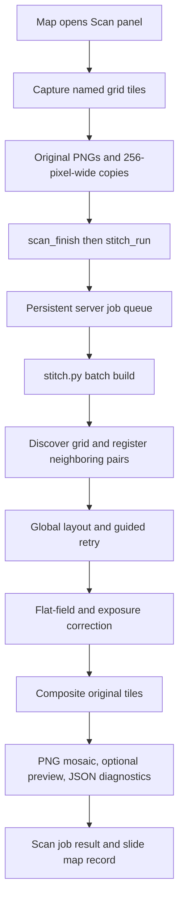

# Map → Scan: image stitching implementation

Reverse-engineered from repository revision `649180e`, inspected on 2026-09-28. This document describes the current code, including observed implementation quirks. It covers the Scan panel's batch mosaicing pipeline; motor control and autofocus are included only where they affect its image inputs.

## 1. What actually runs

Map → Scan uses a custom Python **translation-only image stitcher** in `stitch.py`. It estimates relative tile translations by normalized cross-correlation (NCC), solves a globally consistent layout, corrects illumination/exposure, and averages overlapping image data into a mosaic.

Alignment runs on images at most **256 pixels wide**. Final compositing reads the original saved images. There is no later full-resolution registration pass in this workflow, so preserving original image detail does not imply original-pixel alignment accuracy.

The separate Map → Stitch and Map → AStitch tools are different workflows. `autostitch.py`, the manual stitch implementation, archived live stitching, and `stitch.py`'s incremental `add`/`watch`/`locate` modes are not called by Map → Scan.



Source entry points:

| File | Relevant functions / responsibilities |
| --- | --- |
| [Map panel](webserved_dir/o_component__map.js) | Opens the Scan panel through `f_open('scan')`. |
| [Scan panel](webserved_dir/o_component__scan.js) | `f_a_o_tile__path`, `f_start_scan`, `f_stitch`, `f_poll_jobs`: tile naming, capture, options, queue submission, results. |
| [Capture helper](webserved_dir/o_capture.module.js) | `f_o_capture__frame`: full-frame PNG capture, potentially with capture-time flat-field correction. |
| [Server](webserver_denojs.js) | WebSocket handlers, queue initialization, completed mosaic registration in `a_o_map`. |
| [Job queue](scan_jobs.module.js) | `f_o_scan_jobs`: durable job lifecycle and one active stitch process. |
| [Python launcher](stitch_functions.module.js) | `f_o_stitch_run`: exact Python invocation and output collection. |
| [Stitcher](stitch.py) | Registration, graph optimization, photometry, compositing, diagnostics. |

## 2. Input images and capture order

The browser traverses the selected grid in a serpentine pattern: even rows left-to-right, odd rows right-to-left. Each file records its logical grid location, not its capture sequence:

```text
scans/scan_<timestamp>/
    tile_r00_c00.png
    tile_r00_c01.png
    tile_r01_c00.png
    ...
    dowscaled/
        tile_r00_c00.png
        ...
```

`dowscaled` is the actual directory spelling used by the application.

After movement/settling and optional autofocus, `f_o_capture__frame()` captures the whole video frame with no requested crop or size reduction. The browser saves the PNG, decodes that same blob, and draws it onto a smaller canvas. Thus the registration copy and original represent the same captured frame. The smaller width is `min(256, original_width)`; height preserves aspect ratio with rounding.

The saved original can already include the application's active capture-time flat-field/dust correction, if its calibration matches the frame dimensions. This is independent of the Scan panel's Python flat-field checkbox. Both corrections can therefore be applied in one workflow.

The stitch request contains no motor steps, calibrated pixel-per-step value, or expected tile overlap. Normal Scan filenames contain row/column indices only. Their indices select likely neighbors; their actual pixel spacing and direction are inferred from image content.

## 3. Queue, options, and exact invocation

On successful completion of the capture loop, the client sends `scan_finish`. The server recounts saved tile PNGs and marks the job `ready`. With automatic stitching enabled and at least two captured tiles, the client then sends `stitch_run`. A stopped partial scan can also reach this path; it is not required to contain the entire requested rectangle.

`stitch_run` acknowledges queueing immediately. The browser polls `scan_jobs_list` every two seconds. A single server worker runs stitch jobs in enqueue order, allowing capture of another scan while stitching continues.

The launcher executes the equivalent of:

```bash
venv/bin/python3 stitch.py scans/scan_<timestamp> \
  -o scans/scan_<timestamp>/stitched.png \
  --positions scans/scan_<timestamp>/positions.json \
  --report scans/scan_<timestamp>/report.json \
  --registration-max-width 256 \
  --jobs 2
```

It adds flags according to the selected options:

| UI option | Initial default | Python behavior |
| --- | --- | --- |
| Stitch automatically | Enabled | Queue after capture; does not change the algorithm. |
| Minimum match score | `0.3` | `--min-score`; threshold for accepting NCC matches. |
| Maximum output size | `0` | Nonzero value adds `--max-dim`; resize after full compositing. |
| Feather blending | Enabled | Default `--blend feather`; disabled sends `--blend none`. |
| Flat-field correction | Enabled | Disabled adds `--no-flatfield`. |
| LoFTR rescue | Disabled | Enabled adds `--matcher loftr`. |

Saved settings can override these UI defaults. Re-stitching a job with stored options reuses that job's options rather than the current controls. Exposure gain compensation is enabled independently of flat-field correction and has no Scan panel toggle.

The launcher sets `OMP_NUM_THREADS=1` and `OPENBLAS_NUM_THREADS=1`; registration workers also set OpenCV threads to one. `--jobs 2` controls registration processes, while the queue allows only one stitch job at a time.

Job state is persisted through temporary-file replacement of `stitch_job.json`. States include `capturing`, `ready`, `queued`, `running`, `complete`, `failed`, and `interrupted`. After server restart, previously running/capturing jobs become interrupted; queued jobs resume. Closing the browser does not stop an already queued server stitch. Each job retains at most 400 log lines.

## 4. Discovery and the neighbor graph

`discover_tiles()` collects supported image files from the input directory and sorts their names naturally. The normal invocation is nonrecursive, so it does not load images inside `dowscaled/` as separate tiles.

`infer_grid()` recognizes names such as `tile_r03_c07.png`. Automatic grid detection requires:

- At least four files with recognizable grid coordinates.
- Unique coordinates forming a complete rectangle of the distinct row/column labels.
- At least as many recognized tiles as skipped files.

Recognized row/column labels are remapped to contiguous indices. On successful inference, files without grid coordinates, such as previous `stitched.png` and preview output, are excluded.

For an `R × C` grid, `build_pairs()` matches immediate right and down neighbors only:

```text
pair count = R × (C - 1) + (R - 1) × C
```

There are no diagonal pairs. Capture order does not affect this adjacency because filenames encode logical locations.

If grid inference fails, ordinary Scan files fall back to all `N(N-1)/2` pairs. In particular, two- or three-tile scans and incomplete rectangles use this fallback. Previous mosaic/preview files are then not automatically removed by the successful-grid filtering path, so re-stitching such folders can inadvertently include generated outputs as inputs. The launcher's command does not provide a tile-only `--pattern` filter.

## 5. Reduced-resolution registration

`prepare_registration_images()` establishes a common tile size from the first original, then prepares registration images:

```text
rw = min(original_width, 256)
rh = max(1, round(original_height × rw / original_width))
sx = rw / original_width
sy = rh / original_height
```

Existing reduced copies are reused only if they are readable, have the expected dimensions, and are at least as new as their originals. Otherwise Python regenerates them with OpenCV area interpolation. Separate `sx` and `sy` account for height rounding. Smaller images are not enlarged.

For this workflow, the coarse search scale is set to `1.0` relative to the reduced copies. Both initial search and refinement use these reduced images, including LoFTR rescue. Function names such as `_full_gray` refer to the full registration image here, not the camera original.

### Pairwise matching

The sign convention is:

```text
p_j - p_i = (dx, dy)
a[y, x] corresponds to b[y - dy, x - dx]
```

For each candidate pair:

1. Convert to float grayscale, then high-pass filter by subtracting Gaussian blur. Default sigma is eight original-image pixels, scaled by `min(sx, sy)` for registration.
2. Search integer translations with overlap-normalized NCC. FFT cross-correlation supplies the cross-product sum; integral images supply the local sums and squared sums for each overlap rectangle.
3. Select the maximum score, then refine around it using expanded overlap crops and a restricted NCC search.
4. Reject an overlap below the minimum area. The default minimum is 2% of tile area, with additional pixel floors for the search stages.
5. Use Hanning-windowed phase correlation on the aligned overlap for a fractional-pixel residual. This is skipped for overlap dimensions below 24 registration pixels. Each residual component is clamped to ±0.9 registration pixels.
6. Convert the displacement to original-image units: `dx /= sx`, `dy /= sy`; overlap area is divided by `sx × sy`.

For an overlap of `n` pixels, the NCC expression is:

```text
NCC = [Σab - (Σa)(Σb)/n]
      / sqrt([Σa² - (Σa)²/n] [Σb² - (Σb)²/n])
```

Overlap regions with insufficient variance are invalidated. A pair normally passes when its score is at least `0.3`; this is a correlation threshold, not a probability of correctness. Repeated texture can still yield an incorrect high-scoring match.

The unrestricted search requires at least `max(64, 0.02 × rw × rh)` overlap pixels. Refinement requires at least the larger of its scaled pixel floor and 35% of the smaller refinement crop. The final area check again enforces the tile-area criterion. Consequently, the effective cutoff is not determined by the 2% setting alone.

Source: `ncc_map`, `best_shift`, `subpixel_residual`, `_worker_init`, `register_pair`, `_register_pair` in [stitch.py](stitch.py).

## 6. Global layout, predictions, and retry

Pairwise shifts become edges in a graph whose nodes are tiles. `solve_positions()` solves:

```text
minimize Σ w_ij × ||(p_j - p_i) - d_ij||²
with p_0 = (0, 0)
```

Measured edges initially receive:

```text
w_ij = max(0, NCC)² × [0.25 + min(1, overlap_area / (0.5 × tile_area))]
```

The implementation constructs a dense graph Laplacian and solves both coordinate dimensions. It runs six iterations of Huber iteratively reweighted least squares, reducing the influence of edges whose displacement conflicts with the overall graph. Its adaptive residual threshold has a two-original-pixel lower bound.

For a recognized grid, failed edges may be replaced by low-weight predicted translations from `StepModel`. Prediction priority is:

1. A robust linear fit versus column index for the same direction and source row, requiring at least four accepted samples with varying columns.
2. Median shift for that direction and source row.
3. Global median shift for that direction (`right` or `down`).

Predicted edges have fixed weight `0.02` and kinds `prior:fit`, `prior:line`, or `prior:global`. They can bridge weakly textured regions, but are inferred placements rather than measured image matches. If there are no accepted pairs at all, the build fails before these priors can establish a layout, unless optional LoFTR first rescues a pair.

The default second pass retries failed measured pairs around the initial layout's predicted displacement, using a default ±90-original-pixel search radius converted to registration units. It retains improvements and solves the graph again.

Disconnected graphs and large residuals produce warnings, not necessarily failure. Separate graph components have no reliable relative placement and may overlap incorrectly in the final output. Measured residuals above 25 original pixels are explicitly warned about.

### Optional LoFTR rescue

When enabled, PyTorch/Kornia LoFTR proposes translations for unresolved pairs. It uses outdoor pretrained weights by default and CUDA when available, otherwise CPU. Correspondences below confidence `0.5` are removed; at least eight consistent matches must remain after median/MAD translation filtering.

Every proposal must still pass the ordinary NCC registration threshold. Verification uses a default 64-original-pixel search radius. LoFTR is attempted after guided retry, or earlier if NCC solved no pair at all.

LoFTR can estimate rotation/scale as a diagnostic, but the mosaic still applies translations only. In the Scan path, its input is also the reduced registration copy, despite the generic matcher's 1024-pixel long-side limit.

## 7. Illumination and exposure correction

Photometric correction happens after registration and before blending, on original-resolution image data.

### Flat-field estimation

`estimate_flatfield()` samples up to 48 tiles. At each camera-pixel location and color channel, it takes the 50th percentile across sampled tiles. It computes this in 160-row bands, smooths the resulting field with Gaussian sigma `max(8, min(H,W)/12)`, normalizes by the field's overall mean, and floors the normalized field at `0.15`.

Each original tile is divided by this field. The assumption is that stationary camera-coordinate shading persists across tiles while specimen content varies. Specimen structure recurring at the same camera coordinates can contaminate the estimate. Disabling the Scan flat-field checkbox disables this estimation, not previously baked-in capture correction.

### Exposure gains

`compute_gains()` measures mean grayscale brightness in matched overlap rectangles, using rounded pairwise shifts. With flat-field enabled, grayscale data is divided by the grayscale field first. Overlap dimensions below eight pixels are skipped.

`solve_gains()` finds one scalar gain per tile by minimizing weighted overlap brightness differences, regularized toward gain one. It normalizes the gains to mean one and clamps them to `[0.75, 1.35]`.

The build path supplies only edges whose kind is exactly `measured` to gain estimation. LoFTR-rescued edges and predicted priors therefore do not contribute to this photometric solve.

Conceptually, the prepared color image is:

```text
corrected_tile(x,y,c) = original_tile(x,y,c) / field(x,y,c) × tile_gain
```

## 8. Compositing and actual blending behavior

`composite()` translates all solved positions into nonnegative canvas coordinates:

```text
origin = (minimum solved x, minimum solved y)
canvas_position_i = solved_position_i - origin
canvas_width  = ceil(max(canvas_position_x) + tile_width)
canvas_height = ceil(max(canvas_position_y) + tile_height)
```

The original tile is decoded as color, resized to the common tile dimensions if needed, corrected for illumination/exposure, and cached. Integer placement uses `floor(canvas_position)`. Fractional offsets above `0.02` pixels are applied with cubic `warpAffine` interpolation and replicated borders. The mask itself is not fractionally warped.

The compositor processes horizontal bands, default height 2048 pixels. Within each band:

```text
accumulator += corrected_tile × mask
weight_sum  += mask
output = clip(accumulator / max(weight_sum, 0.000001), 0, 255)
```

Output is three-channel 8-bit color. Uncovered regions remain black. There is no seam optimization, multiband/Laplacian blending, local deformation, perspective warp, or missing-content synthesis.

### Important discrepancy: feather blending

`feather_mask()` intends to use normalized distance from invalid border pixels as the blending weight. It builds a binary tile mask, applies `cv2.distanceTransform`, normalizes by the maximum, and optionally raises weights to a power.

However, default `--crop 0` makes that binary mask entirely nonzero: it contains no zero border for the distance transform. In the installed OpenCV `5.0.0`, a direct probe of `feather_mask(100, 120, 0, 1)` returned **minimum = maximum = 1.0**. Thus the current default feather setting produces uniform overlap averaging in this environment. A probe with `crop=1` produced a varying mask from zero to one. Scan does not expose or pass a nonzero crop setting.

Also, `--blend none` replaces the mask with a binary mask but retains the same weighted-sum/division compositor. It therefore means equal-weight averaging in overlaps, not overwrite/paste without blending. Under the observed default mask behavior, toggling feather blending has no effect on overlap weights.

### Memory and scaling

Band processing bounds the float accumulation buffers, but the whole 8-bit output canvas remains in RAM. Approximate major allocations are:

- Final image: `3 × canvas_width × canvas_height` bytes.
- Band accumulation and weights: `16 × canvas_width × band_height` bytes.
- Prepared tile cache: up to 24 float32 color tiles by default, approximately `12 × tile_width × tile_height` bytes each.
- Additional flat-field, grayscale caches, registration workers, and dense layout/gain matrices.

The layout and gain solvers use dense matrices, so they also become expensive at large tile counts. Flat-field estimation repeatedly decodes sampled originals for successive bands.

`--max-dim` resizes only after the full mosaic has been allocated and composited. It reduces the saved image size, not the peak full-resolution compositing allocation.

## 9. Outputs, coordinate interpretation, and map integration

| Artifact | Contents |
| --- | --- |
| `stitched.png` | Corrected, composited image; optionally resized by maximum output size. |
| `stitched_preview.jpg` | Written only if the final image's longest side exceeds 4000 pixels; JPEG quality 92. |
| `positions.json` | Original tile size plus filename, path, row, column, and solved floating-point `x/y` for every tile. |
| `report.json` | Per candidate pair: filenames, displacement, NCC, overlap area, kind, residual. |
| `stitch_job.json` | Persistent job status, settings, result paths, timestamps, retained logs. |

`positions.json` coordinates are original-image pixels anchored to the first tile, not final PNG coordinates. To locate a tile on the unresized output, subtract the minimum x/y across all solved positions. If maximum output size resized the mosaic, multiply by that additional scale. The batch positions file does not explicitly store the canvas origin or final output scale.

Despite the CLI help saying positions can be reused, this batch path writes `positions.json`; it does not read it to bypass registration on a subsequent Scan stitch. Re-stitching recomputes placement, while valid `dowscaled/` copies can be reused.

`report.json` serializes the measured candidate-edge list, not the synthetic prior-edge list used by the layout solver. Failed edges may consequently have an uninformative default residual even when a separate predicted edge placed those tiles. The report is not a complete export of all layout constraints.

`coverage_report()` estimates uncovered area at 4% scale within the convex hull of tile centers. Above 0.05% uncovered area, it warns that the scan contains gaps. This is a diagnostic based on the solved layout, not a correction operation or independent proof of motor movement accuracy.

The launcher considers a normal build successful when Python exits successfully and `stitched.png` exists. It returns any existing preview, positions, and report paths. Warnings do not automatically make a job fail. Old artifacts are not cleared before re-stitching; for example, an old preview can remain even if a new smaller mosaic no longer generates one.

For a job associated with a slide, successful completion creates or updates an `a_o_map` record with kind `scan`, output/preview/folder paths, and `b_primary=true`; other primary maps for that slide are unset. Map dimensions are initially recorded as zero in this callback. Library-link failure is logged without changing successful stitching into a failed job. The Scan UI displays the preview if present, otherwise the full mosaic, and offers the full image through `/api/file`.

## 10. What was verified

This analysis followed the live Scan → WebSocket → queue → launcher → Python call chain rather than relying on older design documents or generic stitcher comments.

The existing focused tests were run successfully:

```bash
venv/bin/python -m unittest discover -s tests -p test_scan_stitch.py
```

Both tests passed. They cover reduced-copy sizing/reuse, separate x/y scale factors, registration and retry reading only reduced files, original-resolution displacement recovery, full-resolution compositing, exclusion of reduced copies from recursive discovery, and avoiding enlargement of small images. They do not validate real-slide quality, LoFTR, flat-field estimation, or all queue/browser behavior.

The feather-mask behavior described above was verified separately with the installed OpenCV. No live scan was acquired and no existing scan was reprocessed. Only this documentation file was added.
