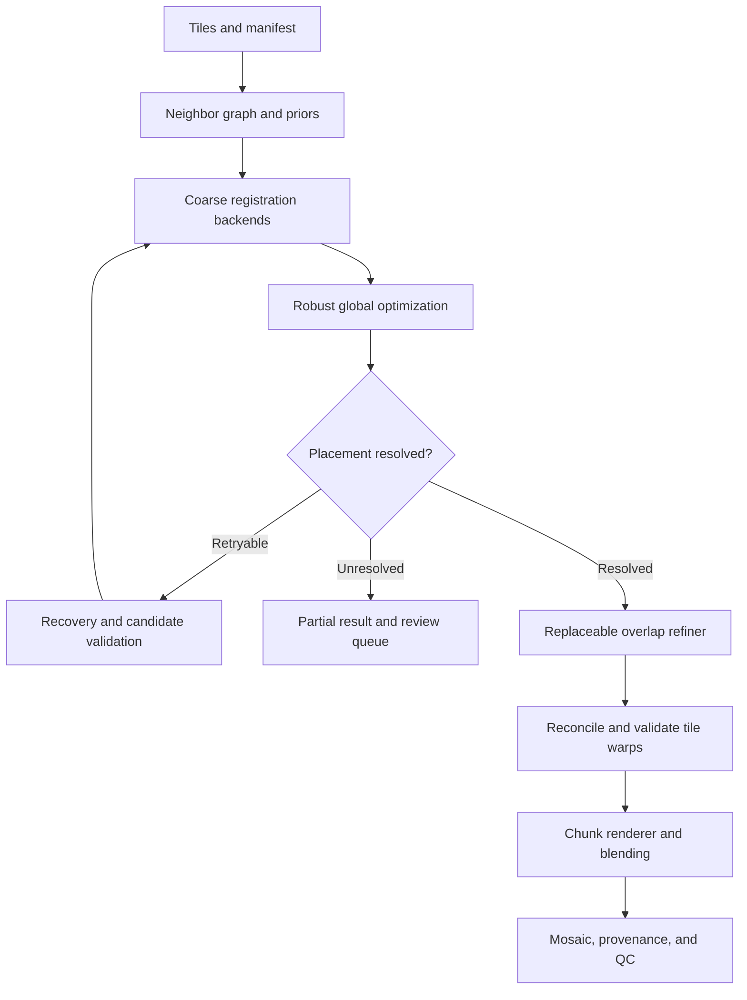

# Microscope Mosaicing: Implementation and Benchmark Plan

**Version:** 1.0  
**Date:** 2026-09-24  
**Audience:** Software, computer vision, and microscopy teams  
**Status:** Engineering specification. Interfaces, configuration, commands, and tests below are proposed implementation requirements; no pipeline or benchmark has been executed on the user's images.

## 1. Goal and agreed scope

Build one large microscope-slide mosaic from original images with known row and column positions. Support PixelStitch as a replaceable local alignment component, and make coarse registration replaceable too. The system must recover from failed registrations where other evidence exists and identify placements that remain uncertain.

Initial target: approximately 20 tiles, with a design that supports larger acquisitions through chunked rendering. Tile dimensions, bit depth, channels, overlap, hardware, and output format must be confirmed during the first milestone.

### Required outcomes

- Load tiles and row/column metadata; validate the acquisition.
- Construct a neighbor graph and estimate relative tile positions.
- Optimize all tile positions together and recover failed edges where possible.
- Refine eligible overlaps using interchangeable backends, including PixelStitch.
- Reconcile local refinement into one consistent spatial mapping per original tile.
- Render original data into a mosaic with reproducible blending and quality reports.
- Compare backends on the same microscope data, including failures and difficult slides.
- Preserve original images, transformation provenance, and an inspectable baseline result.

### Core decisions

1. Row and column define topology; they do not determine exact pixel offsets.
2. Start with translation geometry. Introduce affine geometry only when data demonstrates a need. A backend's homography input does not require the whole mosaicer to use unrestricted projective geometry.
3. Estimate global positions before dense local refinement. A dense flow field cannot generally be reduced to one equivalent translation or homography.
4. The mosaicing engine owns graph construction, optimization, warp reconciliation, rendering, and QC. Model-specific code stays inside adapters.
5. A refined output is optional per overlap. A trustworthy coarse placement remains usable if refinement is rejected.
6. A grid prediction or graph-inferred placement is a prior, not a newly observed image registration.
7. Failed or disconnected placements remain visible in the output report. Do not silently invent a verified placement.
8. Sample each output level directly from the originals or a declared source pyramid using the final composed mapping. Do not recursively stitch already rendered mosaics.

## 2. Architecture and module boundaries



| Module | Responsibility | Persisted result |
| --- | --- | --- |
| Ingest | Validate inputs, read metadata, build registration previews | Validated manifest and input hashes |
| Graph builder | Enumerate plausible neighbors and connected components | Candidate edge list |
| Coarse registration | Produce multiple candidates when necessary | Measurements, uncertainty, and diagnostics |
| Recovery coordinator | Retry within a bounded policy; distinguish measurement from inference | Attempt history and unresolved cases |
| Pose optimizer | Fit global positions using reliable measurements and explicit priors | Positions, component IDs, residuals |
| Overlap refinement | Invoke a selected algorithm through a common contract | Correspondences or normalized warp proposals |
| Warp reconciler | Produce one final mapping per tile from all accepted constraints | Meshes/maps and validation results |
| Renderer | Sample originals using final maps in bounded memory | Mosaic chunks and coverage mask |
| Composer | Apply declared intensity correction and blending | Final image and contribution metadata |
| Evaluator | Compute independent metrics and comparison reports | Per-edge, per-tile, and per-slide results |

Use separate versioned packages or worker processes for model dependencies if needed. The core must be able to load metadata, optimize poses, and render the baseline without importing PixelStitch or requiring a GPU.

## 3. Input and coordinate contracts

### 3.1 Manifest

The following is an example, not an assumption about the user's microscope:

```json
{
  "schema_version": "1.0",
  "slide_id": "slide_001",
  "grid": {
    "row_direction": "+y",
    "column_direction": "+x",
    "nominal_overlap_fraction_x": null,
    "nominal_overlap_fraction_y": null
  },
  "tiles": [
    {
      "id": "tile_007",
      "path": "tiles/tile_007.tif",
      "row": 1,
      "column": 2,
      "width": 2048,
      "height": 2048,
      "dtype": "uint16",
      "channels": ["intensity"],
      "pixel_size_um_x": null,
      "pixel_size_um_y": null,
      "stage_x_um": null,
      "stage_y_um": null,
      "acquisition_index": 7
    }
  ]
}
```

Require unique tile IDs and unique spatial row/column positions within each imaging plane. Validate dimensions against the files. Missing grid cells are allowed. Record stage calibration, orientation, lens correction, and flat-field calibration if available.

Confirm that row/column are spatial positions rather than acquisition indices. A serpentine scan's acquisition order may reverse on alternate rows. Keep time points, focal planes, and incompatible channels separate unless the acquisition model explicitly defines how they relate.

Use preprocessing for registration without overwriting the original high-bit-depth data. Document any grayscale conversion, normalization, channel selection, or resizing. A model's input representation must not silently determine the output bit depth or intensity scale.

### 3.2 Coordinate conventions

| Item | Contract |
| --- | --- |
| Point representation | `(x, y)`; arrays indexed `[y, x]` |
| Tile frame | Original-resolution pixel centers; first center `(0, 0)`; x right, y down |
| Mosaic frame | Same axis directions, in original-resolution pixel units |
| Physical units | Optional micrometers, separately recorded; never mix with pixel coordinates |
| Matrix convention | Homogeneous column vectors; explicitly named source and destination |
| Coarse tile position | `P_i = (x_i, y_i)`, the mosaic position of tile pixel center `(0, 0)` |
| Edge displacement | `d_ij = P_j - P_i` |
| Forward tile mapping | `F_i(p) = P_i + p + u_i(p)` for translation plus local deformation |
| Rendering map | `B_i(q)`, mosaic point to source-tile sampling point; store separately from forward maps |
| Dense field metadata | Source frame, destination frame, grid origin, spacing, units, direction, validity mask |

Warping APIs often use backward sampling fields. A backward field is not obtained by simply negating a forward displacement at the same coordinates. The adapter must establish and test the conversion it actually uses.

Store the complete crop, resize, and padding transform for every model input. For an original transform `H` from A to B and original-to-model transforms `S_A`, `S_B`, the model-space transform is `S_B H inverse(S_A)`. Include any additional model-specific coordinate convention explicitly.

Preserve the engine's original frame when shifting the final canvas to nonnegative output coordinates; record the canvas offset in output metadata.

## 4. Neighbor graph and coarse registration

### 4.1 Candidate graph

For every existing tile `(r, c)`, first connect `(r, c+1)` and `(r+1, c)` if present. A complete 4-by-5 acquisition yields 31 undirected neighbor pairs. Do not duplicate edges by also registering the reverse as an independent measurement.

Use diagonal or more distant edges only when predicted footprints actually overlap. A missing intermediate tile does not imply that the tiles on either side overlap.

Estimate nominal stride from calibrated stage displacement, acquisition metadata, or a robust consensus of successful registrations. For uniform tiles with known overlap fractions, an initial stride is `width * (1 - overlap_x)` and `height * (1 - overlap_y)`. If overlap is unknown, use a bounded coarse search and seek consistency across several textured edges; keep spacing unresolved if evidence is insufficient.

### 4.2 Initial backend sequence

1. Translation estimation with phase/correlation-based matching within a predicted search region.
2. Feature matching plus robust translation estimation when correlation fails or is ambiguous.
3. Optional rigid or affine candidate generation when a justified geometric model requires it.
4. Future learned matching backends through the same interface.

Use downsampled views for broad search and original-resolution overlap data for final checks. Preserve several hypotheses for repetitive tissue instead of immediately forcing a single answer.

### 4.3 Candidate validation

Inspect actual valid overlap area, informative tissue coverage, photometric or feature residual, spatial distribution of matches, plausible displacement, and consistency with other measurements. A large correlation peak on a nearly blank overlap is not sufficient.

Each candidate records:

- Tile IDs, backend ID/version, attempt ID, and transform direction.
- Transformation and/or matched point coordinates in original tile frames.
- Score components, estimated uncertainty where available, inlier count and spread.
- Valid overlap area and texture/tissue diagnostics.
- Status: `accepted`, `ambiguous`, or `failed`, with reason codes.
- Preprocessing, search bounds, elapsed time, and links to debug previews.

Raw confidence values from different algorithms are not interchangeable probabilities. Use backend-specific thresholds calibrated on development slides or a shared evaluator with documented score normalization.

## 5. Global optimization and coarse-alignment recovery

### 5.1 Global position solve

For translation geometry, minimize:

```text
sum over accepted edges (i,j):
    w_ij * robust_loss(norm((P_j - P_i) - d_ij))
plus explicit grid/stage prior penalties where available.
```

Fix one position per connected component to remove translation ambiguity. Use uncertainty-aware weights and a robust loss; record rejected measurements and the resulting graph connectivity after outlier removal. Use weak grid priors only when their accuracy supports that weight.

Report component-relative placement separately from cross-component placement. Independent anchors make a numerical solve possible but do not establish the true distance between disconnected components. Do not place disconnected components on top of one another and call the result complete.

### 5.2 Recovery policy

| Condition | Action | Required status/evidence |
| --- | --- | --- |
| Expected overlap is wrong | Expand search at reduced resolution, then refine | Independently validate the recovered overlap |
| Correlation is weak | Try a feature-based backend and suitable geometry | Verify support and spatial distribution |
| Repeated tissue yields several candidates | Retain candidates and test surrounding graph consistency | Keep ambiguous if alternatives remain plausible |
| One edge fails but an alternate graph path exists | Solve positions using the other edges; retry near predicted displacement | Prediction remains a prior until image evidence validates it |
| Blank or textureless overlap | Use other verified neighbors or calibrated acquisition information | Label image-unsupported placement as inferred |
| Single tile has no accepted edges | Try all physically plausible overlapping neighbors | Require trusted stage/grid prior or manual anchor if unresolved |
| Whole group is disconnected | Return a separate component or place using trusted external coordinates | Expose uncertainty and external evidence source |
| No true overlap or missing tissue | Mark a coverage gap | Do not fill it with invented image content |

Use a configurable attempt budget, initially one broad-search retry, one alternative backend attempt, and one graph-informed retry. These are engineering starting values to tune on development data. Stop when no new verified measurements are found or the budget is exhausted.

Graph-inferred placements may seed an image search. Adding those same predictions as fresh independent edges would double-count the existing evidence and artificially inflate confidence.

Store placement evidence as `image_supported`, `prior_supported`, `manual_anchor`, or `unresolved`. Record uncertainty or its unavailability. A manual anchor is a versioned input that can be reviewed and reproduced.

### 5.3 Terminal behavior

- `complete`: every required tile is placed with image evidence or an explicitly accepted external placement policy; include per-tile evidence labels.
- `partial`: some components or tiles remain unresolved; emit available components and a review queue.
- `failed`: input is invalid, no usable placement is available, or a required stage cannot complete.

Emit a separate QC acceptance flag. Completing a render does not imply that all quality gates passed.

## 6. Replaceable component interfaces

The following names define the intended contracts. They are interface specifications, not a claim that these classes already exist.

```python
class CoarseRegistrar(Protocol):
    def register(self, request: CoarseRequest) -> CoarseResult: ...

class OverlapRefiner(Protocol):
    def refine(self, request: RefineRequest) -> RefineResult: ...

class WarpReconciler(Protocol):
    def solve(self, request: WarpSolveRequest) -> TileWarpSet: ...
```

| Contract | Required fields |
| --- | --- |
| `CoarseRequest` | Tile references, masks, original coordinate metadata, search prior and bounds, allowed geometry, budget |
| `CoarseResult` | Candidate transforms/point matches, status, backend-specific scores, uncertainty, diagnostics |
| `RefineRequest` | Tile references, accepted coarse poses, actual overlap, crop/resize mappings, masks, model scale, deformation limits |
| `RefineResult` | Status, normalized matches or supported warp proposals, validity masks, backend identity, diagnostics, timing |
| `WarpSolveRequest` | Coarse poses, accepted local constraints, support regions, regularization settings and anchors |
| `TileWarpSet` | One final forward map per tile, corresponding rendering map or inversion method, masks, validation report |

Use a versioned result schema. The adapter may return model-native diagnostic artifacts, but the core depends only on normalized fields. Publish capability metadata: supported channels/dtypes, input size constraints, geometry expectations, GPU requirement, and output type.

### Backend registry

Implement `identity`, one conventional flow refiner, and `pixelstitch` first. `identity` is a successful no-op with zero local displacement, not a registration failure. Choose the conventional flow implementation during the technical spike and pin its version.

Changing `refinement.backend` in configuration must select another compliant adapter without changing graph construction, optimizer, renderer, or evaluator. The coarse backend registry has the same requirement.

Treat backend loading errors, timeouts, invalid outputs, and GPU memory exhaustion as structured failures. Benchmark reports must retain those failures even if production falls back successfully.

## 7. PixelStitch integration

The official repository reviewed for this plan provides inference code and a checkpoint, requires a separately computed homography expressed as a `(4, 2)` array of corner displacements, and describes the release as the pixel-wise warp stage. Its README states that training code is not provided and identifies UDIS-D as its training/evaluation dataset. Verify these details against the chosen commit before integration. [Source: official repository](https://github.com/MakiseChris666/PixelStitch).

### Adapter tasks

1. Pin the repository commit, checkpoint checksum, dependencies, and adapter version. Reproduce an upstream inference example.
2. Inspect implementation details for image order, transform direction, corner order, pixel-boundary versus pixel-center convention, normalization, masks, and returned warp direction.
3. Convert engine poses to the relative transform and corner-offset input expected by the model. Translation can be represented as a homography for this adapter.
4. Preserve every crop, resize, and padding transform. Test conversion on known translations before using real tissue.
5. Establish a grayscale/multichannel input policy from the actual model requirements; keep the original channels for rendering.
6. Expose usable deformation fields or correspondences before final blending. This may require a maintained wrapper or a small upstream-code patch. A finished pair panorama alone is insufficient for the engine's refinement contract.
7. Normalize valid local correspondences into original tile coordinates. For bidirectional warps, derive correspondences through their shared frame or verified mapping operations; do not assume every returned flow directly maps A to B.
8. Run independent validity and alignment checks; return `success`, `no_improvement`, `unsupported_input`, or `failed` with diagnostics.
9. Cache results by image hashes, poses, preprocessing, model/checkpoint, and configuration.

A plausible initialization is a prerequisite. Coarse failures go through recovery first. Multiple plausible initializations may be tested under a bounded budget, but smooth-looking blended output alone cannot select the winner.

Acceptance of the adapter requires coordinate-contract tests and at least one end-to-end microscopy comparison. Do not describe the model as microscopy-validated until the benchmark supports that conclusion.

## 8. Reconcile refinement into one mapping per tile

Independent pairwise outputs can conflict: a tile may be pulled in different directions by its left, right, top, and bottom neighbors. Directly applying one warp per pair does not define a consistent multi-tile mosaic. This is a required engineering stage.

### Proposed first implementation: regularized per-tile mesh

For accepted corresponding points `(p_i, p_j)`, fit local deformation meshes such that:

```text
F_i(p_i) approximately equals F_j(p_j)
where F_i(p) = P_i + p + u_i(p).
```

Use a robust correspondence term plus penalties for deformation magnitude, roughness, and shape changes. Keep the solved coarse poses fixed in the initial implementation, constrain the mesh's constant translation mode, and set unsupported interior regions toward zero deformation. Choose control-point spacing and allowed motion on development slides, using physical units where calibration exists.

All accepted constraints for a tile enter the same solve, including multi-tile overlap junctions. Weight by support and calibrated reliability. After the solve, check:

- Landmark/correspondence agreement across every affected neighbor, not just the refined edge.
- Maximum displacement, local scale/shape change, and fold detection.
- Continuity between supported and unsupported regions.
- Valid inversion/sampling maps and coverage.
- Agreement at three- and four-tile overlap junctions.

Tapering or smoothing can also distort tissue; it must pass the same checks. Deformation limits are scientific/product choices, not arbitrary universal pixel constants.

If conflicting constraints cannot produce a valid result, remove the weakest independently assessed constraint and re-solve within a fixed budget. If still invalid, use the coarse baseline for the affected connected refinement group and record the rejected refinements. Do not leave incompatible neighboring maps in the final render.

Compare constrained global deformation with the raw pairwise result during development. Global constraints may intentionally suppress a visually pleasing pair warp that harms structural consistency elsewhere.

## 9. Rendering, blending, and output

Determine bounds from final warped tile footprints, including curved edges where applicable. Render in chunks with sufficient halo for interpolation and blending. Compose coarse and local maps before sampling the original data. A shared spatial map must be applied consistently to channels that are physically aligned.

Start with valid-mask-aware feather blending. Record the selected interpolation, boundary behavior, and weight normalization. Preserve intensity precision while accumulating, then convert once to the declared output type with documented clipping/rounding.

Estimate any intensity correction separately from geometry. Support uncorrected export and preserve correction parameters for quantitative imaging. Keep blending and intensity policy fixed when comparing refinement backends.

Choose one production export format at the output-format milestone: a chunked pyramid or a tiled large-image format with appropriate scientific metadata. Confirm the consumer/viewer's requirements before selecting a specific format. Build a simple small-image debug exporter first.

### Required run artifacts

| Artifact | Contents |
| --- | --- |
| `run.json` | Run ID, input hashes, configuration, code/model versions, hardware, timing, completion and QC status |
| `manifest.json` | Validated original tile metadata and preprocessing records |
| `edges.jsonl` | Every registration/refinement attempt, including rejected candidates and reasons |
| `poses.json` | Global positions, component IDs, priors, evidence labels, residuals |
| `warps/` | Accepted mesh/field data with coordinate and validity metadata |
| `mosaic.*` | Declared image output with calibration and canvas offset |
| `coverage.*` | Acquired support, gaps, and unresolved placement indicators |
| `provenance.json` | Original tile references, final maps, blend/correction settings needed to reconstruct contributions |
| `qc.html` or equivalent | Tile map, edge diagnostics, before/after overlays, failure review |
| `metrics.csv` and `summary.json` | Benchmark or production QC results |

For blended pixels, dominant source ID alone is incomplete provenance. Retain all contributing sources and weights, or enough maps and deterministic blend metadata to reconstruct them.

## 10. Benchmark design

### 10.1 Two complementary comparison tracks

| Track | Fixed components | Changed component | Purpose |
| --- | --- | --- | --- |
| Refinement comparison | Input slides, coarse poses, preprocessing policy, warp reconciler, renderer, blending | Identity / conventional flow / PixelStitch / future refiners | Attribute improvement to refinement |
| Complete pipeline comparison | Input slides, evaluation annotations, output requirements | Coarse registration, recovery policy, refinement as a versioned configuration | Measure real operational quality and recovery |

Report both. Restricting every evaluation to successful coarse registrations would hide the failure cases that matter in production.

For each refiner, run an all-eligible-overlaps evaluation and a separate gated production-policy evaluation. Use the same eligibility rules when comparing algorithms, report unsupported cases, and give each method an explicitly documented tuning budget. Do not choose different easy subsets for different methods.

### 10.2 Dataset and annotations

- Begin with a representative development set and a separate locked test set of complete slides. A practical pilot is 5 development and 5 held-out slides when available; expand before drawing broad conclusions.
- Split by slide and, where possible, by specimen/acquisition session. Never let overlapping crops of one slide cross the split.
- Include dense tissue, sparse tissue, repeated texture, illumination variation, blur, low overlap, missing tiles, blank overlaps, and focus variation actually present in acquisition.
- Include a small real-image set with independently annotated correspondences. Start with 10-30 distinct landmarks on informative overlaps; mark blank overlaps as unobservable instead of inventing landmarks.
- Include landmarks near seams, at multi-tile junctions, and outside overlaps for distortion checks. Record annotation uncertainty and have a subset reviewed by a second annotator.
- Hold evaluation landmarks out of registration, model selection on the locked set, and refinement acceptance logic.
- Add synthetic crops with exact known offsets and controlled perturbations. They test geometry and failure behavior; they do not establish performance on real microscopy.

### 10.3 Metrics

| Metric | Definition/measurement | Interpretation |
| --- | --- | --- |
| Landmark discrepancy | `norm(F_i(p_i) - F_j(p_j))` for independently annotated matching points | Lower is better; report median, 95th percentile, and slide-level results |
| Absolute placement error | Compare recovered positions to known synthetic truth after removing a common offset | Detects drift and global placement errors |
| Coarse loop closure | Signed sum of independently measured edge displacements around a graph loop | Diagnose inconsistent measurements; summing solved position differences is trivially zero |
| Refined junction consistency | Agreement of mapped landmarks in three/four-way overlaps | Detects contradictory local deformations |
| Distortion | Mesh Jacobian determinants and singular values, landmark distance/area changes | Detect folds, excessive compression/stretching, and shape changes |
| Content integrity | Blinded review of duplicated, omitted, or deformed structures | Count and classify errors; prioritize over seam appearance |
| Seam appearance | Blinded scores on equal-scale, identical crops | Secondary visual metric |
| False acceptance | Incorrect/implausible registration accepted on annotated or synthetic cases | Track separately from rejection and recovery rates |
| Recovery | Initially failed cases recovered and independently verified | Include unresolved cases in the denominator |
| Coverage | Original tissue supported, clipped, missing, or unplaced | Distinguish acquisition gaps from renderer errors |
| Operational performance | Cold/warm latency, end-to-end runtime, peak RAM/VRAM, timeouts, OOM events | State hardware, batch size, resolution, precision, and I/O inclusion |

Measure geometry before blending. Photometric similarity after blending is not sufficient evidence of correct alignment; blending or deformation can hide mistakes. Relative landmark agreement also needs distortion controls because both images could be deformed incorrectly together.

For timing on a GPU, account for asynchronous execution in the measurement implementation. Separate model loading from warm inference, and include conversion/reconciliation/rendering in end-to-end timings.

### 10.4 Reporting and decision rule

Produce paired comparisons on identical slides. Report all attempted cases, successes, fallbacks, unsupported inputs, crashes, and unresolved placements. A production fallback is not a model success. Use slide-level aggregates and, with sufficient slides, confidence intervals from resampling slides rather than treating every landmark as independent.

Define thresholds on development data before opening the locked test results:

- Allowed landmark error in pixels and, when calibrated, micrometers.
- Allowed distortion and content-integrity regression.
- Maximum false-acceptance and unresolved-placement rates.
- Minimum meaningful improvement over identity refinement.
- Runtime and memory budgets for the actual deployment hardware.

Reject accepted warps with non-finite coordinates or detected folds in valid tissue. Require a reviewable explanation for any structural change. The microscopy owner must set acceptable shape/measurement tolerances; this plan does not assume that any pixel displacement is harmless.

Promote PixelStitch only if it meets the agreed structural and operational gates and provides useful quality improvement. The benchmark must be able to conclude that identity refinement is the best current production choice on a subset or on the entire acquisition type.

## 11. Concrete automated test specifications

These are tests for the team to implement. Numerical values below define synthetic fixtures, not release thresholds for real tissue.

### 11.1 Geometry and contract tests

| ID | Fixture | Required assertion |
| --- | --- | --- |
| G01 | Complete 4-by-5 grid | Exactly 31 unique right/bottom edges; no duplicate reverse edges |
| G02 | Duplicate position; one missing tile | Duplicate rejected; missing tile retained as a gap with only physically plausible neighbors |
| G03 | Exact 2-by-2 positions `(0,0)`, `(80,0)`, `(0,80)`, `(80,80)` and correct edges | Optimizer recovers positions within `1e-6` pixel after anchoring; all edge signs are correct |
| G04 | Delete one edge from G03 while keeping graph connected | All positions remain recoverable; missing edge is still labeled unmeasured until independently registered |
| G05 | Two disconnected tile groups | Separate components reported; no claimed relative image-based placement between them |
| G06 | Deliberately inconsistent loop and one large outlier | Nonzero measured loop residual reported; affected solution flagged or outlier rejected according to policy |
| G07 | Graph-inferred edge with no new image support | It never becomes an independent accepted measurement |
| G08 | Known point grid through crop, resize, pad, and inverse mappings | Coordinates round-trip to numerical tolerance; transformation direction preserved |
| G09 | Simple translation encoded for a backend | Corner-offset conversion and reconstructed transform agree at held-out points, including non-square dimensions |
| G10 | Different array and spatial axis conventions | X/Y shifts land on the expected marker; no silent transpose or sign inversion |

### 11.2 Registration, recovery, and refinement tests

| ID | Fixture | Required assertion |
| --- | --- | --- |
| R01 | Overlapping crops from a fixed random-texture image with known integer offsets | Translation recovered within the fixture's declared tolerance and valid overlap mask |
| R02 | Wrong initial stride outside normal search but inside widened search | Retry recovers truth or returns unresolved; it must not confidently accept the wrong offset |
| R03 | Uniform or nearly blank images | No image-supported placement claimed from the blank overlap |
| R04 | Periodic repeated pattern with multiple equivalent offsets | Ambiguity preserved until independent grid evidence resolves it |
| R05 | Images with no true overlap | No valid correspondence invented; gap/unresolved status reported |
| R06 | Weak edge with a successful alternate graph path | Graph prediction seeds retry; accepted result requires fresh image validation |
| R07 | Identity refiner | Zero deformation and valid no-op result; baseline remains reproducible |
| R08 | Adapter returns NaN, infinity, wrong shape, missing frame metadata, or invalid mask | Contract validation rejects result and records a reason |
| R09 | Synthetic fold, excessive stretch, or opposing pair constraints on one tile | Final warp rejected or constraints re-solved; tile never has multiple incompatible final maps |
| R10 | Four-tile overlap with landmarks shared across pairs | Reconciled maps satisfy the junction test or the refinement group falls back |
| R11 | Model timeout or GPU OOM | Bounded failure, recorded fallback, no false refinement-success count |
| R12 | Changed checkpoint, input image, preprocessing, or initial pose | Cache invalidated; unchanged requests may reuse prior output |
| R13 | Forward/backward maps for a known smooth invertible deformation | Composition returns original points within stated interpolation tolerance; simple sign negation is not assumed |

### 11.3 Rendering and system tests

| ID | Fixture | Required assertion |
| --- | --- | --- |
| S01 | Small mosaic rendered whole and by chunks | Same coverage and values within declared interpolation/rounding tolerance; no chunk seams |
| S02 | Valid black pixels, bright pixels, and explicit invalid masks | Black tissue is not treated as missing; only masks govern validity |
| S03 | High-bit-depth ramp and multiple aligned channels | No unrequested 8-bit conversion, channel misregistration, or undocumented intensity clipping |
| S04 | Tile with bowed warped boundary or negative coordinates | Bounds include all valid mapped data; canvas offset is recorded |
| S05 | Overlap pixel contributed by several tiles | Provenance reconstructs contributing sources and weights |
| S06 | Interrupted run resumed after a completed stage | Valid cached work reused; partial artifacts are not mistaken for complete outputs |
| S07 | Backend switched only in configuration | Common output schema, renderer, and evaluator work without backend-specific branches |
| S08 | Partial dataset with unresolved component | Partial result includes component IDs and review queue; no false complete/QC-pass status |

CI should run deterministic geometry, contract, and small rendering tests on CPU. Run model smoke tests on the pinned GPU environment when available. Locked-set quality benchmarking is a release gate, not a substitute for deterministic tests.

## 12. Configuration and proposed workflow

Illustrative configuration; names and defaults must be implemented and validated:

```yaml
schema_version: "1.0"
geometry:
  model: translation
  nominal_stride_source: estimate_from_verified_edges
coarse:
  primary: phase_correlation
  fallback: feature_translation
  retain_ambiguous_candidates: true
recovery:
  widened_search_attempts: 1
  alternative_backend_attempts: 1
  graph_retry_passes: 1
  unresolved_policy: export_components
optimization:
  robust_loss: huber
  prior_policy: explicit_uncertainty
refinement:
  backend: pixelstitch
  on_rejection: identity
  adapter_version: null
  upstream_commit: null
  checkpoint_sha256: null
  acceptance_profile: null
warp_reconciliation:
  method: regularized_mesh
  on_group_failure: coarse_baseline
render:
  blending: feather
  preserve_source_precision: true
  chunk_size: null
  output_format: null
benchmark:
  split: locked_test
  report_failures: true
```

Null deployment parameters are deliberate placeholders. Validate them before production; they are not implicit runtime defaults. Resource sizes, deformation limits, and acceptance profiles must come from the first technical spike and development measurements.

Proposed commands for the team to implement:

```bash
mosaic validate --manifest manifest.json
mosaic register --manifest manifest.json --config baseline.yaml --out runs/coarse
mosaic render --run runs/coarse --refiner identity --out runs/baseline
mosaic refine --run runs/coarse --config pixelstitch.yaml --out runs/pixelstitch
mosaic benchmark --dataset benchmark.json --matrix comparison.yaml --out reports/comparison
```

These commands do not exist yet. The implementation must expose equivalent stage-specific operations, persist intermediate results, and support rerendering without rerunning registration or model inference.

## 13. Delivery milestones and ownership

| Milestone | Owner role | Deliverables | Acceptance gate |
| --- | --- | --- | --- |
| M0: Acquisition and model spike | Imaging + CV engineers | Representative tiles, metadata audit, pinned upstream example, warp-output inspection, hardware measurements | Confirm true row/column semantics and access to usable PixelStitch fields/correspondences |
| M1: Data and contracts | Software engineer | Manifest validation, graph, coordinate schemas, backend registry | G01-G02 and coordinate contract fixtures pass |
| M2: Baseline and recovery | CV engineer | Coarse backends, robust global solver, retry policy, partial-component output | Synthetic truth, ambiguity, outlier, and disconnection cases pass |
| M3: Rendering and QC | Software/imaging engineer | Baseline mosaic, chunk renderer, provenance, edge inspection | Baseline hand review and rendering tests pass |
| M4: Refinement and reconciliation | CV engineer | Identity, conventional flow, PixelStitch adapters; one warp per tile | Adapter conversion, folds, junctions, fallback, and configuration swapping pass |
| M5: Comparative validation | QA + microscopy owner | Locked dataset, independent annotations, paired report, acceptance profiles | Quality and resource decision recorded per backend |
| M6: Production output and reliability | Software engineer | Chosen output format/pyramid, resume/caching, bounded resource use, operator guide | Representative full acquisition completes with reviewable quality status |

Dependencies: M1 precedes M2; a baseline path through M2-M3 is required before accepting M4 results. Dataset annotation can begin during M0. Pin interfaces early, but revise them if M0 exposes a genuine model-output incompatibility. Each revision requires a schema/version decision and contract-test updates.

Do not schedule based solely on the number of tiles. Full-resolution sizes, GPU constraints, model adaptation, and scientific distortion tolerances are the main unknowns. Estimate effort after M0 rather than promising a fixed calendar from this document.

## 14. Definition of done

- [ ] A row/column acquisition produces a deterministic baseline mosaic or an explicit partial result.
- [ ] Both coarse registration and refinement can be replaced through registered adapters and configuration.
- [ ] PixelStitch runs from a pinned source/checkpoint with verified coordinate conversions.
- [ ] Failed coarse alignment follows a bounded, tested recovery policy.
- [ ] Ambiguous, prior-supported, disconnected, and manually anchored placements remain distinguishable.
- [ ] Every original tile has one final mapping; multi-neighbor refinement conflicts are handled.
- [ ] Accepted maps satisfy declared structural and coverage checks.
- [ ] Rendering preserves the declared image precision and uses bounded memory.
- [ ] Original data, intermediate evidence, final maps, and blending provenance are retained.
- [ ] The benchmark includes real held-out slides, synthetic geometry cases, failures, and runtime/memory results.
- [ ] The team has an evidence-based decision on when to enable PixelStitch and when to use the baseline.
- [ ] The operator can inspect a failed edge and understand the evidence, recovery attempts, and final decision.

## 15. First-sprint decisions and reference

Resolve with representative data: imaging modality, tile size/bit depth/channels, typical overlap, stage calibration, orientation, missing-tile behavior, intended quantitative measurements, output reader, deployment hardware, and acceptable placement/deformation error. These affect configuration and acceptance profiles, not the decision to isolate algorithms behind adapters.

**Official source:** [PixelStitch repository and README](https://github.com/MakiseChris666/PixelStitch). Consult its linked paper and the pinned inference implementation during M0 for exact model behavior. The multi-image orchestration, recovery policy, mesh reconciliation, interfaces, and benchmark in this document are proposed engineering design, not features claimed to be supplied by that repository.
